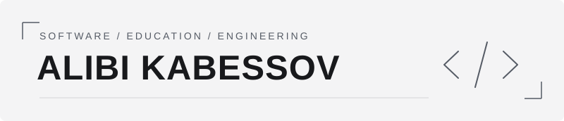

<picture>
  <source media="(prefers-color-scheme: dark) and (max-width: 600px)" srcset="assets/wordmark-mobile-dark.svg">
  <source media="(max-width: 600px)" srcset="assets/wordmark-mobile.svg">
  <source media="(prefers-color-scheme: dark)" srcset="assets/wordmark-dark.svg">
  
</picture>

### I build products, tools and the systems behind them.

**Software Developer · Computer Science Educator**

I take ideas from interface to infrastructure: React applications, Python APIs, background workers and Docker deployments. I build practical tools for real users and explore ideas through personal projects.

[Selected Work](#selected-work) &nbsp; / &nbsp; [Technical Stack](#technical-stack) &nbsp; / &nbsp; [Engineering Approach](#engineering-approach) &nbsp; / &nbsp; [Contact](#contact)

## Selected Work

###  &nbsp; CodeArena

**From a classroom network to a complete programming contest.**

Built a self-hosted platform where educators create problems, organize individual or team contests, and track live standings. Students write and submit solutions directly in the browser.

- **Execution engine:** automatic judging in isolated Docker containers, with support for six programming languages.
- **Contest operations:** scoring, frozen standings and reveal, clarifications, rejudging, and teacher-controlled participation.
- **Complete product:** React interface with Monaco Editor, role-based access, database migrations, backups, and English, Russian and Kazakh localization.

`Python` `FastAPI` `React` `TypeScript` `SQLite` `SQLAlchemy` `Docker`

<a href="https://github.com/paifln/codeArena"><strong>Explore CodeArena</strong> </a> &nbsp; / &nbsp; <a href="https://github.com/paifln/codeArena/tree/main/backend/judge">Judging engine</a>

###  &nbsp; DOCUMENTOR

**Academic document review, developed for a university.**

Built for **Makhambet Utemisov West Kazakhstan University** to help review student papers. A Telegram interface turns a DOCX submission into a structured PDF report covering formatting, document structure, language and academic style.

- **Document processing:** extracts DOCX content, checks formatting against configurable rules, and generates reports with actionable feedback.
- **AI integration:** combines deterministic checks with AI-assisted analysis; incomplete analysis is explicitly reported.
- **Asynchronous architecture:** PostgreSQL stores review jobs, Redis queues background work, and delivery retries do not rerun the analysis. Supports English, Russian and Kazakh.

`Python` `aiogram` `PostgreSQL` `Redis` `ARQ` `python-docx` `ReportLab` `Docker`

<a href="https://github.com/paifln/documentor_bot"><strong>Explore DOCUMENTOR</strong> </a> &nbsp; / &nbsp; <a href="https://github.com/paifln/documentor_bot/blob/main/docs/ARCHITECTURE.md">Architecture</a>

## Technical Stack

My toolkit for applications, automation and hands-on experimentation.

| Area | Technologies |
| :--- | :--- |
|  **Languages** | `Python` `TypeScript` `JavaScript` `Luau` |
|  **Frontend** | `React` `HTML` `CSS` `Tailwind CSS` `Vite` `TanStack Query` `Zustand` `i18next` `Monaco Editor` |
|  **Backend** | `FastAPI` `Pydantic` `aiogram` `SQLAlchemy` `Alembic` `ARQ` |
|  **Data** | `PostgreSQL` `SQLite` `Redis` |
|  **Documents & AI** | `python-docx` `ReportLab` `lxml` `OpenAI SDK` `HTTPX` |
|  **Delivery** | `Git` `GitHub Actions` `Docker` `Docker Compose` |
|  **Quality** | `pytest` `Vitest` `Testing Library` `Ruff` `Prettier` |
|  **Hardware** | `Arduino` `ESP32` |

## Engineering Approach

 **Build the whole workflow.** Connect the interface, API, data model and background processing around the task a user needs to complete.

 **Design for failure and recovery.** Isolate code execution, retry document delivery, preserve review state, and provide backup and recovery paths.

 **Make complex tools usable.** Teaching computer science informs how I structure interfaces, explain results and build software for people with different technical backgrounds.

**Current interests:** algorithms, backend engineering, system design, developer tools and robotics.

## Contact

 **Let's talk about software engineering opportunities.**

Open to software engineering roles, product teams and collaboration on useful tools.

  <a href="mailto:kabessovalibi007@gmail.com"> <strong>Email</strong></a>
  &nbsp; / &nbsp;
  <a href="https://www.linkedin.com/in/alibi-kabessov-60b97b43a/"> <strong>LinkedIn</strong></a>
  &nbsp; / &nbsp;
  <a href="https://github.com/paifln"> <strong>GitHub</strong></a>

